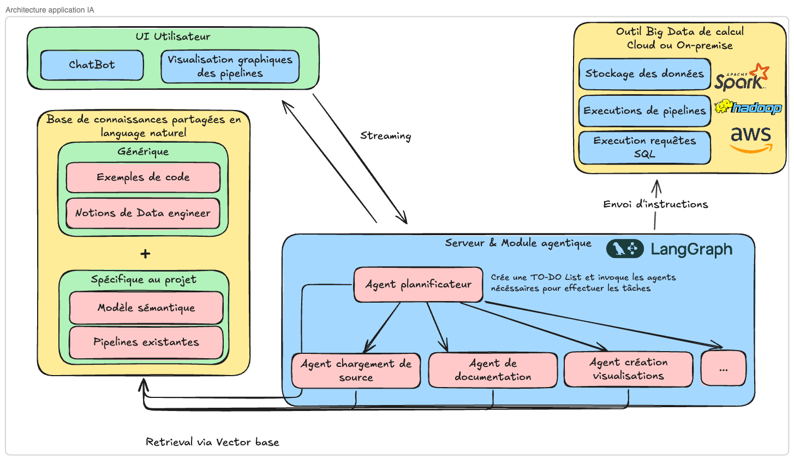

# Dossier d'Initialisation de Projet : Agentic Data Engineer Team

Ce document présente le projet « Agentic Data Engineer Team », une solution innovante visant à révolutionner la gestion des données en entreprise par l'intégration d'une équipe d'agents d'intelligence artificielle. Notre objectif est d'augmenter significativement les capacités des ingénieurs data et de démocratiser l'accès aux données pour les profils non techniques. En automatisant les tâches répétitives de création de pipelines, d'exécution de requêtes SQL (Text-to-SQL) et de visualisation de données, nous visons à accélérer le _time-to-market_, améliorer la qualité des données et optimiser les processus. Le projet se distingue par son approche collaborative homme-machine, où l'IA assiste et propose, tandis que l'humain conserve le contrôle final et la capacité d'intervention. Cette solution s'inscrit parfaitement dans l'évolution du marché de la Data, offrant un avantage concurrentiel majeur aux entreprises.

## 1. Idée de Projet : L'Équipe d'IA Data Engineers

### 1.1. Concept Fondamental

L'idée maîtresse est de concevoir une **équipe d'IA Data Engineers** capable d'accompagner les ingénieurs data et les utilisateurs moins techniques dans la construction de pipelines de données, l'exécution de requêtes SQL, et la création de visualisations. Loin de remplacer les experts humains, cette solution vise à les **augmenter**, en simplifiant et automatisant les tâches répétitives et chronophages. Cette approche libère les ingénieurs pour des missions à plus forte valeur ajoutée et permet aux profils non techniques d'interagir plus intuitivement avec les données.

### 1.2. Bénéfices Clés

Le déploiement de cette équipe d'IA apportera plusieurs avantages stratégiques :

- **Gain de temps et accélération du Time-to-Market** : En automatisant la création et la gestion des pipelines, les entreprises peuvent réduire drastiquement le temps nécessaire pour exploiter leurs données, répondant ainsi à un besoin croissant d'agilité.
- **Amélioration de la qualité des données** : L'IA peut fournir un retour constant et proactif sur la qualité des données, permettant des corrections rapides et une meilleure fiabilité des analyses.
- **Démocratisation de l'accès aux données** : Les utilisateurs non techniques pourront interagir avec les systèmes de données via un chatbot en langage naturel, éliminant la barrière de la connaissance technique des bases de données ou des langages de programmation.
- **Optimisation des ressources** : Les ingénieurs data peuvent se concentrer sur des défis complexes et l'innovation, tandis que l'IA gère les tâches routinières.
- **Idéation rapide** : L'accélération des cycles d'itération sur les pipelines facilite la validation rapide d'hypothèses basées sur les données.

## 2. Fonctionnalités Clés

Le projet se concentrera sur les fonctionnalités suivantes, accessibles via une interface conviviale et un chatbot en langage naturel :

### 2.1. Création et Gestion de Pipelines de Données (ETL)

L'IA sera capable d'automatiser les tâches d'un processus ETL (Extraction, Transformation, Chargement) classique :

- **Chargement et Analyse de Sources de Données** : Intégration de nouvelles sources, analyse de leur structure et de leur contenu.
- **Contrôle Qualité des Données (DQC)** : Détection proactive des anomalies et propositions de correction.
- **Enrichissement des Données** : Rattachement à des dimensions existantes, intégration de données externes.
- **Jointure et Agrégation** : Combinaison de multiples sources de données, extraction d'indicateurs clés.
- **Visualisation des Résultats** : Génération automatique de graphiques et tableaux de bord à partir des données traitées.

L'interface pour l'édition des pipelines sera graphique, offrant une vue d'ensemble claire et la possibilité de détailler chaque étape. Un point crucial est la **boucle humaine dans l'IA (Human-in-the-Loop)** : l'ingénieur pourra intervenir manuellement à chaque étape pour modifier, valider ou corriger les propositions de l'IA, assurant ainsi un contrôle total et une adaptation aux cas complexes.

### 2.2. Text-to-SQL

Cette fonctionnalité permettra aux utilisateurs non techniques de récupérer des informations en posant des questions en langage naturel au chatbot. Grâce à un **modèle sémantique** sophistiqué, l'agent fera le lien entre le langage fonctionnel du projet et le modèle de données sous-jacent. Il sera ainsi capable de :

- Comprendre et interpréter la demande utilisateur.
- Écrire une requête SQL optimisée.
- Exécuter la requête et présenter les résultats de manière intelligible.

### 2.3. Fonctionnalités Avancées

Au-delà de la création de pipelines et du Text-to-SQL, l'IA pourra offrir :

- **Contrôle de Dérive de Schéma** : Surveillance automatique et régulière des sources de données pour anticiper et gérer les modifications de schéma.
- **Optimisation des Performances** : Évaluation des temps de traitement des pipelines et suggestion d'optimisations.
- **Documentation Automatique** : Maintien d'une documentation claire et à jour sur les différentes pipelines, une tâche souvent négligée.
- **Intégration de Données Non Structurées** : Qualification et traitement de données textuelles, audio ou vidéo (ex: transcription audio -> résumé texte -> catégorisation de sentiment).

## 3. Analyse de Marché et Différenciation

### 3.1. Solutions Préexistantes et Concurrence

Le marché des outils d'automatisation de données et d'ingénierie data assistée par l'IA est en pleine croissance. Des solutions comme **Matillon Maia** et **Genesis** existent déjà, proposant des approches multi-agents, l'interaction en langage naturel et l'automatisation de bout en bout. Matillon Maia se distingue par ses rôles d'agents spécialisés (ingénieur, analyste, QA), tandis que Genesis met l'accent sur l'intégration profonde avec des outils comme Snowflake et dbt, avec des agents dédiés à la génération de code dbt.

### 3.2. Proposition de Valeur Unique (USP) et Avantages Concurrentiels

Notre projet « Agentic Data Engineer Team » se distingue par :

- **Flexibilité de l'Intervention Humaine** : Contrairement à des solutions plus automatisées, nous mettons l'accent sur une **intégration profonde de l'humain dans la boucle**, permettant une granularité d'intervention à chaque étape du processus. Cela garantit un contrôle maximal et une adaptabilité aux cas d'usage complexes où l'IA seule pourrait échouer.
- **Approche Holistique de l'Ingénierie Data** : Notre solution ne se limite pas à un aspect (ex: ETL ou SQL) mais propose une suite complète de capacités allant de l'ingestion à la documentation, en passant par l'optimisation et l'intégration de données non structurées, offrant une plateforme unifiée pour les besoins en ingénierie data.
- **Modèle Sémantique Avancé et Contextualisation** : L'utilisation d'une base de connaissances partagée et d'un modèle sémantique spécifique au projet permettra une compréhension plus fine du jargon fonctionnel et une meilleure contextualisation des demandes, surpassant les capacités génériques de certains outils.
- **Évolutivité et Adaptabilité** : Le projet est conçu avec une architecture modulaire basée sur des agents, facilitant l'ajout de nouvelles fonctionnalités et l'adaptation à des environnements techniques variés (Cloud/On-premise, différents moteurs Big Data).

## 4. Architecture et Technologies

### 4.1. Vision Architecturale

L'architecture de l'application IA repose sur un modèle multi-agents, orchestré par un **Agent Planificateur**. Cet agent sera responsable de l'interprétation des requêtes utilisateur, de la création d'un plan d'action et de l'invocation des agents spécialisés nécessaires à l'exécution des tâches.

### 4.2. Composants Clés

- **UI Utilisateur** : Interface conviviale incluant un chatbot pour l'interaction en langage naturel et des visualisations graphiques pour la gestion des pipelines.
- **Serveur & Module Agentique** : Cœur de l'application, hébergeant l'Agent Planificateur et les Agents Spécialisés.
  - **Agent Planificateur** : Comprend la tâche demandée, crée un plan d'action et invoque les agents nécessaires.
  - **Agents Spécialisés** : Incluent des agents pour la création de pipelines, la mise à jour de documentation, la création de visualisations, le contrôle qualité du code, le chargement de sources, etc.
- **Base de Connaissances Partagées (Retrieval via Vector base)** : Alimente le contexte des agents et oriente leurs décisions. Elle contiendra :
  - Exemples de code et de morceaux de pipelines.
  - Bonnes pratiques en ingénierie data.
  - Modèle sémantique du projet (lien fonctionnel-technique).
  - Description des pipelines préexistantes.
  - Historique des conversations et feedbacks utilisateurs.
- **Environnement d'Exécution** : Un système de fichiers virtuel partagé et un environnement d'exécution de code arbitraire pour les agents.
- **Outil Big Data de Calcul** : Initialement, focus sur **Apache Spark** pour sa flexibilité et sa puissance de traitement.
- **Stockage des Données** : Solution de stockage flexible, compatible avec Spark (ex: HDFS, S3, Delta Lake).

### 4.3. Technologies Envisagées

- **Framework d'IA Agentique** : LangGraph (ou équivalent) pour l'orchestration des agents.
- **Moteur Big Data** : Apache Spark.
- **Base de Données Vectorielle** : Pour la base de connaissances partagée (ex: ChromaDB, Pinecone).
- **Modèles de Langage (LLM)** : Pour le traitement du langage naturel et la génération de code/requêtes.
- **Technologies Web** : Pour l'interface utilisateur (ex: React, Angular).

## 5. Roadmap et Gestion des Risques

### 5.1. Feuille de Route (MVP et Évolutions)

| Phase       | Jalon Clé                                          | Fonctionnalités Clés (MVP)                                                                                                                                                                                                                                                                                                                                       | Fonctionnalités Futures                                                                                                        | Technologies Cibles              |
| :---------- | :------------------------------------------------- | :--------------------------------------------------------------------------------------------------------------------------------------------------------------------------------------------------------------------------------------------------------------------------------------------------------------------------------------------------------------- | :----------------------------------------------------------------------------------------------------------------------------- | :------------------------------- |
| **Phase 1** | **MVP - Pipelines Simples et Text-to-SQL Basique** | - Chatbot pour interaction en langage naturel.   - Création de pipelines ETL simples (chargement, transformation basique, écriture).   - Text-to-SQL pour requêtes simples sur une base de données sémantique limitée.   - Interface graphique pour visualisation et modification manuelle des pipelines.   - Intégration avec Spark pour le calcul. | - DQC avancé.   - Enrichissement de données.   - Jointures complexes.                                                    | LangGraph, Spark, LLM, Vector DB |
| **Phase 2** | **Optimisation et Fonctions Avancées**             | - Amélioration du DQC.   - Optimisation des performances des pipelines.   - Documentation automatique des pipelines.   - Gestion des versions des pipelines.                                                                                                                                                                                            | - Intégration de données non structurées.   - Détection et gestion des dérives de schéma.   - Agents de QA pour le code. | Idem + outils de monitoring      |
| **Phase 3** | **Écosystème Étendu et Personnalisation**          | - Intégration avec d'autres moteurs Big Data.   - Personnalisation avancée des agents.   - Support multi-tenant.                                                                                                                                                                                                                                           | - Marketplace d'agents spécialisés.   - Intégration avec des outils BI.                                                     | Idem + Kubernetes, Microservices |

### 5.2. Gestion des Risques

| Catégorie de Risque      | Description du Risque                                                                                                   | Stratégie d'Atténuation                                                                                                                                                                                             |
| :----------------------- | :---------------------------------------------------------------------------------------------------------------------- | :------------------------------------------------------------------------------------------------------------------------------------------------------------------------------------------------------------------ |
| **Technique**            | Complexité de l'intégration des différents composants (LLM, Spark, agents).   Performance et scalabilité des agents. | Utilisation de frameworks éprouvés (LangGraph).   Architecture modulaire.   Tests de charge et optimisation continue.   Focus initial sur Spark.                                                           |
| **Opérationnel**         | Adoption par les utilisateurs et résistance au changement.   Nécessité d'une intervention humaine fréquente.         | Conception UX/UI intuitive.   Formation et support utilisateur.   Mise en avant des bénéfices d'augmentation.   Boucle humaine intégrée dès la conception.                                                 |
| **Sécurité/Gouvernance** | Gestion des accès et confidentialité des données sensibles.   Risques de prompt injection.                           | Implémentation de mécanismes de sécurité robustes.   Anonymisation/Pseudonymisation des données.   Validation humaine systématique des actions critiques.   Techniques de _prompt engineering_ sécurisées. |
| **Marché/Concurrence**   | Émergence de solutions concurrentes plus performantes.   Évolution rapide des technologies IA.                       | Veille technologique constante.   Innovation continue et différenciation claire.   Agilité dans le développement.                                                                                             |

## 6. Aspects Opérationnels et Éthiques

### 6.1. Gouvernance des Données et Sécurité

La sécurité et la confidentialité des données sont primordiales. Le système sera conçu avec les principes de _Security by Design_ et _Privacy by Design_. Cela inclura :

- **Contrôle d'accès granulaire** : Gestion fine des permissions pour les agents et les utilisateurs.
- **Chiffrement des données** : Au repos et en transit.
- **Conformité réglementaire** : Respect des normes comme le RGPD, HIPAA, etc.
- **Auditabilité des actions** : Chaque action de l'IA sera journalisée pour assurer la traçabilité.

### 6.2. Auditabilité et Explicabilité de l'IA

Pour garantir la confiance et la conformité, il est essentiel que les actions de l'IA soient auditables et explicables. Nous mettrons en œuvre des mécanismes pour :

- **Versioning des pipelines** : Chaque modification ou création de pipeline par l'IA sera versionnée.
- **Visualisation des décisions** : L'interface permettra de visualiser le raisonnement de l'IA (ex: pourquoi telle transformation a été proposée).
- **Actions autonomes vs. Actions à valider** : Distinction claire entre les actions que l'IA peut prendre de manière autonome et celles qui nécessitent une validation humaine.

### 6.3. Impact Humain et Collaboration

Le projet est fondé sur une vision d'**augmentation** des capacités humaines. L'IA ne vise pas à remplacer, mais à émanciper les ingénieurs data des tâches répétitives, leur permettant de se concentrer sur l'innovation et la résolution de problèmes complexes. Pour les utilisateurs non techniques, l'outil ouvre un accès simplifié et autonome aux données, favorisant une culture _data-driven_ à l'échelle de l'entreprise. Une attention particulière sera portée à l'UX/UI pour faciliter cette collaboration homme-machine.

## Conclusion

Le projet « Agentic Data Engineer Team » est une initiative ambitieuse et complète, parfaitement alignée avec les tendances actuelles et futures du marché de la donnée. En proposant une équipe d'IA Data Engineers, nous offrons une solution capable d'augmenter la productivité, d'améliorer la qualité des données et de démocratiser leur accès. Les axes d'amélioration identifiés et intégrés dans ce dossier renforcent sa proposition de valeur, son approche architecturale et sa feuille de route, le positionnant comme un candidat solide pour le concours IA et un projet à fort potentiel de développement. Ce projet R&D évolutif promet de transformer la manière dont les entreprises interagissent avec leurs données, en faisant de l'IA un partenaire essentiel de l'ingénierie data.
